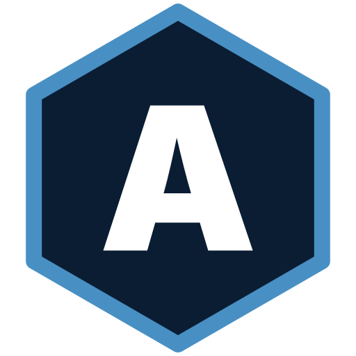

# Axo-Lab

**Studio d'ingénierie logicielle full-stack | Made in Allier**

Conception et développement de produits numériques sur mesure. Web, mobile, intelligence artificielle. Studio indépendant basé en Zone France Ruralités Revitalisation.

---

## Ce que nous faisons

Sept piliers d'expertise, un studio unique, un interlocuteur du premier échange à la mise en production.

| | Pilier | Pour qui |
|---|---|---|
| 🛩️ | **Aéronautique & R&D** | Bureaux d'études, simulateurs, portails SaaS multi-tenants |
| 🏛️ | **Secteur public** | Préfectures, collectivités, organismes parapublics |
| 🏭 | **Applications métier PME** | Logistique, opérations terrain, plateformes internes |
| 🌐 | **Sites internet Allier** | Vitrines, refontes, hébergement managé France |
| 🤖 | **Intelligence artificielle** | Chatbots, RAG, automatisation documentaire |
| 🎓 | **Formation & accompagnement** | Inclusion numérique, montée en compétences IA |
| 🤝 | **Associations & engagement** | Plateformes philanthropiques, projets à impact |

→ Détail complet sur [axo-lab.fr](https://axo-lab.fr)

---

## Notre stack

Stack volontairement resserrée, choisie pour sa robustesse en production et la qualité de l'expérience développeur. Hébergement managé sur infrastructure OVHcloud France.

---

## Comment nous travaillons

**Honnête.** Périmètres clairs, devis détaillés, pas d'engagement de résultat sur ce qui dépend de variables externes (référencement, conversions, adoption utilisateur). Obligation de moyens, jamais de magie promise.

**Ancré.** Allier d'origine et de conviction. Réseau de 7 à 10 développeurs freelances de confiance, mobilisables selon la nature du projet.

**Pérenne.** Code testé, documenté, livré avec sa CI/CD. Vous reprenez la main quand vous voulez, sans dépendance studio.

---

## Présence open source

Ce compte héberge progressivement nos travaux techniques publiables : configurations partagées, templates de projets, outils internes utiles à l'écosystème. Les projets clients restent privés.

Conventions communes à tous nos repos :

- Branches `main` (production) et `develop` (intégration), pull requests obligatoires
- Tests unitaires Vitest + tests E2E Playwright
- CI/CD GitHub Actions, déploiement par image Docker sur GHCR
- Conventional Commits
- Dependabot hebdomadaire (npm + GitHub Actions)

Voir les fichiers `CONTRIBUTING.md` et `SECURITY.md` pour les détails.

---

## Contact

**Axo-Lab** (AXO-LAB SASU)
SIRET 103 310 017 00019 · NAF 6201Z
Le Point Commun, Place Claude Wormser, 03000 Avermes, France

✉️ [contact@axo-lab.fr](mailto:contact@axo-lab.fr)
🌐 [axo-lab.fr](https://axo-lab.fr)
📅 [Prendre rendez-vous](https://cal.com/clement-pandreau)

---

*Studio indépendant. Allier, France.*

